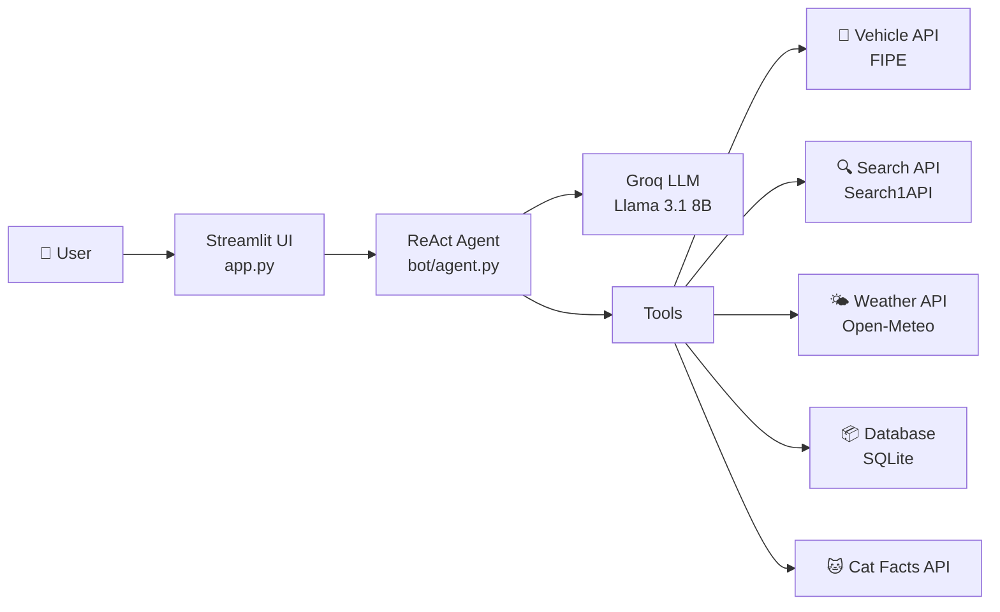

# 🤖 Chatbot e-Commerce

Chatbot cerdas berbasis **LangChain ReAct Agent** dan **Groq** untuk platform e-commerce. Dilengkapi dengan berbagai tools untuk pencarian produk, pemesanan kendaraan, informasi cuaca, dan lainnya.

> **[🚀 Live Demo](https://your-app-name.streamlit.app)** ← *update setelah deploy*

---

## ✨ Fitur

| Fitur | Deskripsi |
|---|---|
| 🚗 **Pemesanan Kendaraan** | Cari merek, model, tahun & pesan kendaraan via FIPE API |
| 🔍 **Perbandingan Produk** | Bandingkan produk apapun secara real-time dari web |
| 🌤️ **Info Cuaca** | Dapatkan cuaca terkini berdasarkan lokasi |
| 🧠 **ReAct Agent** | Agent yang bisa berpikir step-by-step dan memanggil tools |
| 💬 **Chat Memory** | Mengingat konteks percakapan dalam sesi |
| 📦 **Riwayat Order** | Lihat semua order yang pernah dibuat |
| 🕐 **Riwayat Chat** | Simpan dan lihat kembali sesi percakapan sebelumnya |

---

## 🏗️ Arsitektur



---

## 🛠️ Tech Stack

- **LLM**: [Groq](https://groq.com/) — Llama 3.1 8B Instant
- **Framework**: [LangChain](https://langchain.com/) — ReAct Agent
- **UI**: [Streamlit](https://streamlit.io/)
- **Database**: SQLite (thread-safe)
- **APIs**: FIPE, Search1API, Open-Meteo, Cat Facts
- **Deployment**: Streamlit Cloud

---

## 🚀 Deploy ke Streamlit Cloud

### 1. Fork / Push ke GitHub

```bash
git init
git add .
git commit -m "Initial commit"
git remote add origin https://github.com/username/chatbot-ecommerce.git
git push -u origin main
```

### 2. Connect di Streamlit Cloud

1. Buka [share.streamlit.io](https://share.streamlit.io)
2. Klik **"New app"**
3. Pilih repo, branch `main`, file `app.py`
4. Klik **"Deploy"**

### 3. Set Secrets

Di Streamlit Cloud dashboard → **Settings** → **Secrets**, tambahkan:

```toml
GROQ_API_KEY = "gsk_your_groq_api_key_here"
SEARCH_TOKEN = "your_search1api_token_here"
```

---

## 💻 Jalankan Lokal

### Prerequisites

- Python 3.10+
- [Groq API Key](https://console.groq.com) (gratis)
- [Search1API Token](https://search1api.com) (opsional, untuk fitur search)

### Setup

```bash
# Clone repo
git clone https://github.com/username/chatbot-ecommerce.git
cd chatbot-ecommerce

# Install dependencies
pip install -r requirements.txt

# Setup environment
cp .env.example .env
# Edit .env dan isi API keys

# Jalankan
streamlit run app.py
```

Aplikasi akan terbuka di `http://localhost:8501`

---

## 📁 Struktur Project

```
chatbot_project/
├── app.py                    # UI Streamlit (routing & tampilan)
├── requirements.txt          # Dependencies
├── .env.example              # Template environment variables
├── .gitignore                # Files to ignore in git
├── .streamlit/
│   └── config.toml           # Konfigurasi tema & server Streamlit
└── bot/
    ├── __init__.py
    ├── agent.py              # ReAct agent builder (Groq + LangChain)
    ├── database.py           # SQLite CRUD operations (thread-safe)
    ├── utils.py              # Utility functions (input parser)
    ├── prompts/
    │   └── system_prompt.txt  # System prompt untuk agent
    └── tools/
        ├── __init__.py       # Tool registry (ALL_TOOLS)
        ├── vehicle.py        # Tools: brands, models, order, view orders
        ├── product.py        # Tool: product comparison (RAG)
        └── utility.py        # Tools: search, weather, multiply, cat fact
```

---

## 📝 Cara Mendapatkan API Keys

| Service | URL | Catatan |
|---|---|---|
| **Groq** | [console.groq.com](https://console.groq.com) | Gratis, sangat cepat |
| **Search1API** | [search1api.com](https://search1api.com) | Untuk fitur search & product comparison |

---

## 👤 Author

**Miftah Al Ghifari**

---

## 📄 License

MIT License — lihat file [LICENSE](LICENSE) untuk detail.
